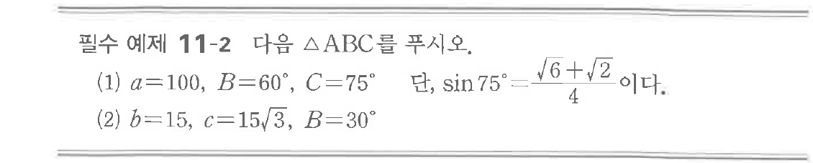

# 필수 예제 11-2

## 문제

다음 $\triangle ABC$를 푸시오.

(1) $a=100$, $B=60^\circ$, $C=75^\circ$

단, $\sin75^\circ=\dfrac{\sqrt{6}+\sqrt{2}}{4}$이다.

(2) $b=15$, $c=15\sqrt{3}$, $B=30^\circ$

## 원문 문제

## 원문

