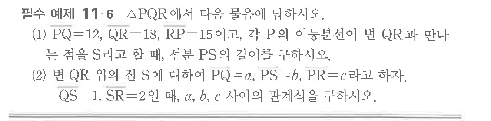
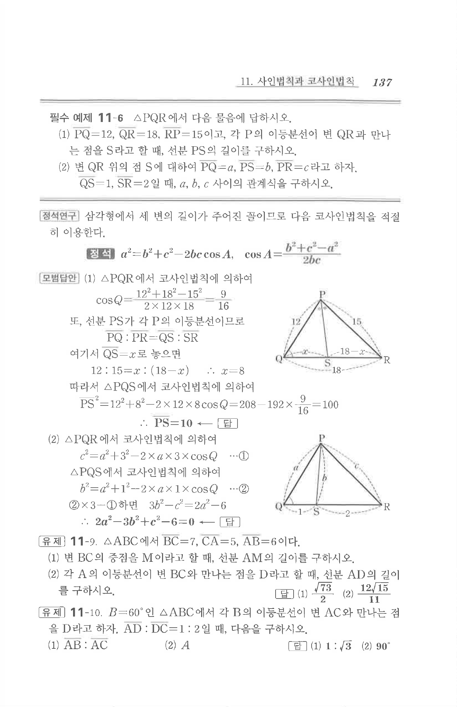

# 필수 예제 11-6

## 문제

$\triangle PQR$에서 다음 물음에 답하시오.

(1) $\overline{PQ}=12$, $\overline{QR}=18$, $\overline{RP}=15$이고, 각 $P$의 이등분선이 변 $QR$과 만나는 점을 $S$라고 할 때, 선분 $PS$의 길이를 구하시오.

(2) 변 $QR$ 위의 점 $S$에 대하여 $\overline{PQ}=a$, $\overline{PS}=b$, $\overline{PR}=c$라고 하자. $\overline{QS}=1$, $\overline{SR}=2$일 때, $a$, $b$, $c$ 사이의 관계식을 구하시오.

## 원문 문제

## 원문

