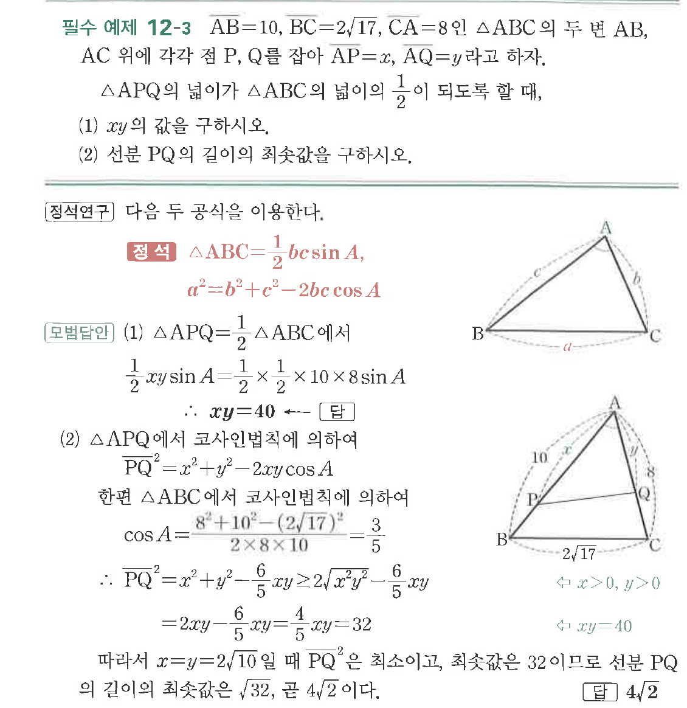

# 필수 예제 12-3

## 문제

$\overline{AB}=10$, $\overline{BC}=2\sqrt{17}$, $\overline{CA}=8$인 $\triangle ABC$의 두 변 $AB$, $AC$ 위에 각각 점 $P$, $Q$를 잡아 $\overline{AP}=x$, $\overline{AQ}=y$라고 하자.

$\triangle APQ$의 넓이가 $\triangle ABC$의 넓이의 $\dfrac{1}{2}$이 되도록 할 때,

(1) $xy$의 값을 구하시오.

(2) 선분 $PQ$의 길이의 최솟값을 구하시오.

## 원문 문제

## 원문

