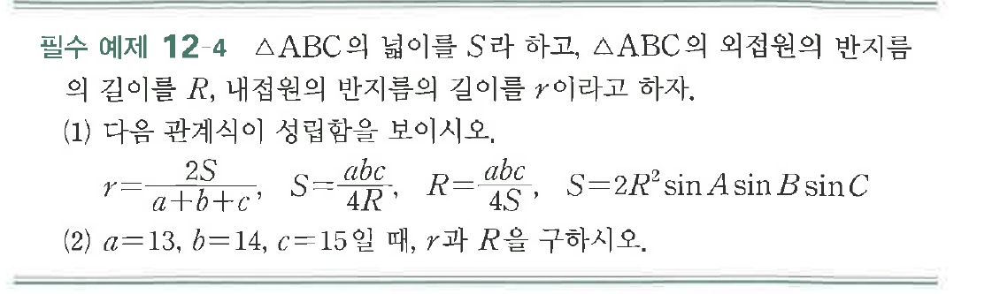
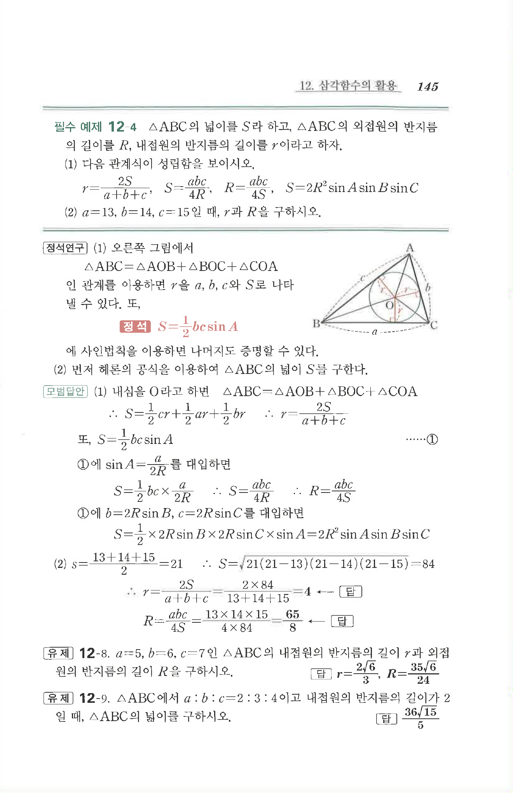

# 필수 예제 12-4

## 문제

$\triangle ABC$의 넓이를 $S$라 하고, $\triangle ABC$의 외접원의 반지름의 길이를 $R$, 내접원의 반지름의 길이를 $r$이라고 하자.

(1) 다음 관계식이 성립함을 보이시오.

$$r=\dfrac{2S}{a+b+c},\quad S=\dfrac{abc}{4R},\quad R=\dfrac{abc}{4S},\quad S=2R^2\sin A\sin B\sin C$$

(2) $a=13$, $b=14$, $c=15$일 때, $r$과 $R$을 구하시오.

## 원문 문제

## 원문

