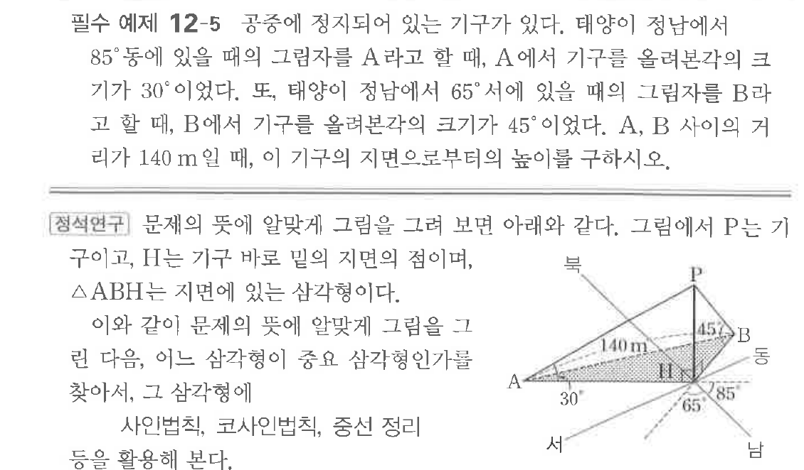

# 필수 예제 12-5

## 문제

공중에 정지되어 있는 기구가 있다. 태양이 정남에서 $85^\circ$ 동에 있을 때의 그림자를 $A$라고 할 때, $A$에서 기구를 올려본각의 크기가 $30^\circ$이었다. 또, 태양이 정남에서 $65^\circ$ 서에 있을 때의 그림자를 $B$라고 할 때, $B$에서 기구를 올려본각의 크기가 $45^\circ$이었다. $A$, $B$ 사이의 거리가 $140\text{ m}$일 때, 이 기구의 지면으로부터의 높이를 구하시오.

## 원문 문제

## 원문

