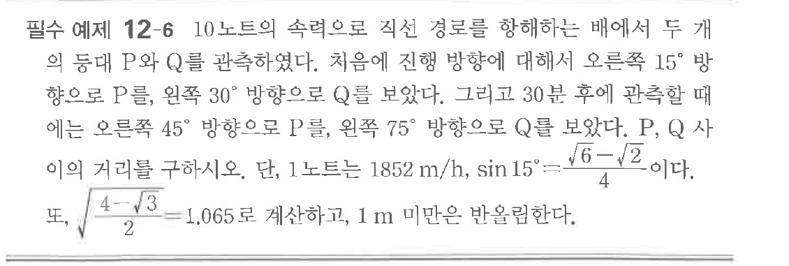

# 필수 예제 12-6

## 문제

$10$노트의 속력으로 직선 경로를 항해하는 배에서 두 개의 등대 $P$와 $Q$를 관측하였다. 처음에 진행 방향에 대해서 오른쪽 $15^\circ$ 방향으로 $P$를, 왼쪽 $30^\circ$ 방향으로 $Q$를 보았다. 그리고 $30$분 후에 관측한 때에는 오른쪽 $45^\circ$ 방향으로 $P$를, 왼쪽 $75^\circ$ 방향으로 $Q$를 보았다. $P$, $Q$ 사이의 거리를 구하시오.

단, $1$노트는 $1852\text{ m/h}$, $\sin15^\circ=\dfrac{\sqrt{6}-\sqrt{2}}{4}$이다. 또, $\sqrt{\dfrac{4-\sqrt{3}}{2}}=1.065$로 계산하고, $1\text{ m}$ 미만은 반올림한다.

## 원문 문제

## 원문

