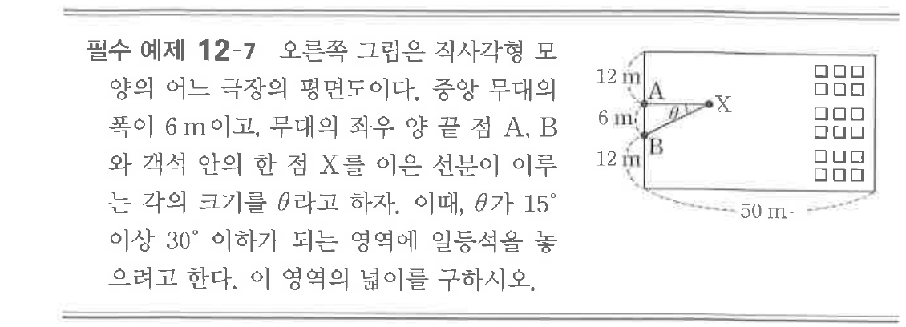
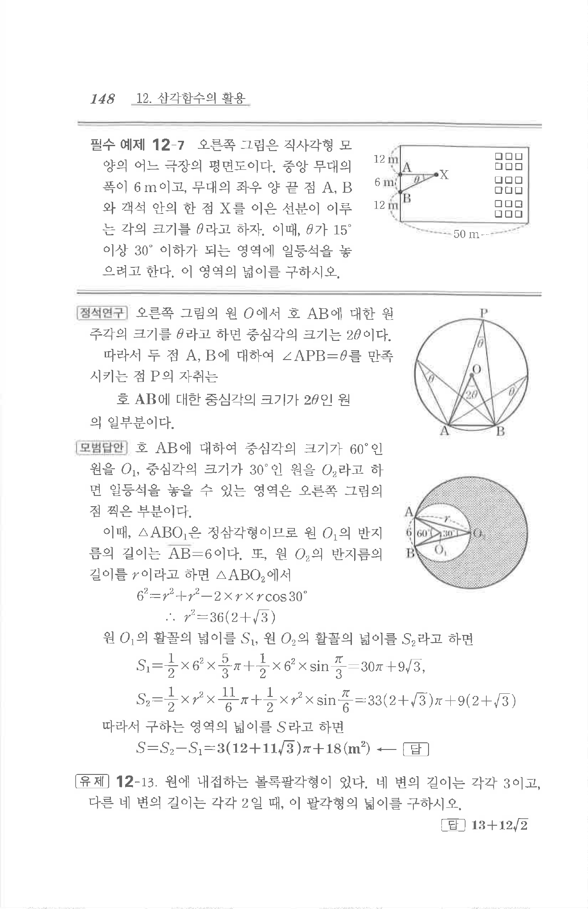

# 필수 예제 12-7

## 문제

오른쪽 그림은 직사각형 모양의 어느 극장의 평면도이다. 중앙 무대의 폭이 $6\text{ m}$이고, 무대의 좌우 양 끝 점 $A$, $B$와 객석 안의 한 점 $X$를 이은 선분이 이루는 각의 크기를 $\theta$라고 하자. 이때 $\theta$가 $15^\circ$ 이상 $30^\circ$ 이하가 되는 영역에 일등석을 놓으려고 한다. 이 영역의 넓이를 구하시오.

## 원문 문제

## 원문

