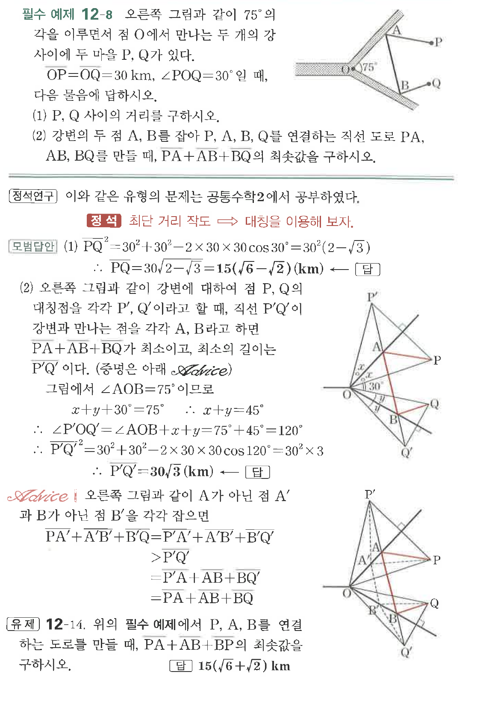
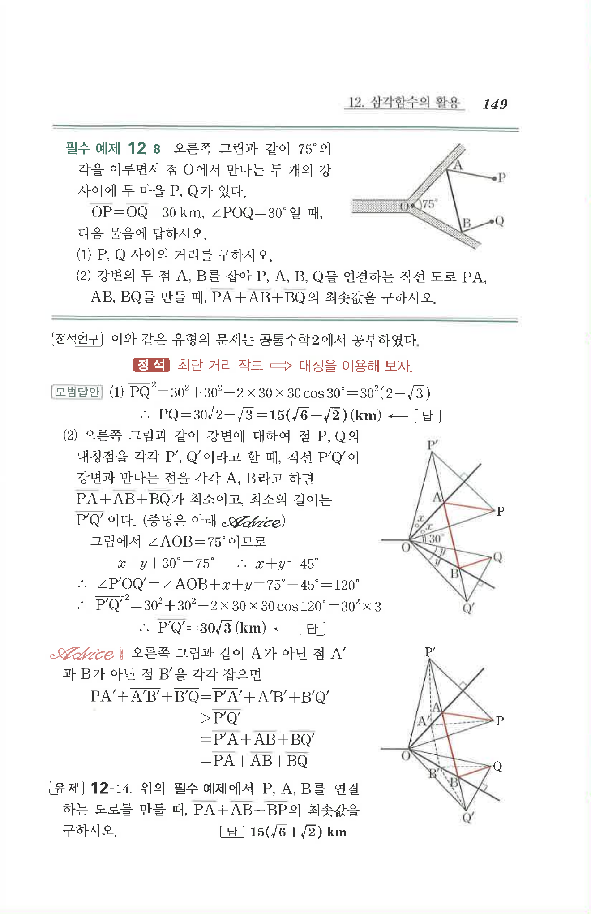

# 필수 예제 12-8

## 문제

오른쪽 그림과 같이 $75^\circ$의 각을 이루면서 점 $O$에서 만나는 두 개의 강 사이에 두 마을 $P$, $Q$가 있다. $\overline{OP}=\overline{OQ}=30\text{ km}$, $\angle POQ=30^\circ$일 때, 다음 물음에 답하시오.

(1) $P$, $Q$ 사이의 거리를 구하시오.

(2) 강변의 두 점 $A$, $B$를 잡아 $P$, $A$, $B$, $Q$를 연결하는 직선 도로 $\overline{PA}$, $\overline{AB}$, $\overline{BQ}$를 만들 때, $\overline{PA}+\overline{AB}+\overline{BQ}$의 최솟값을 구하시오.

## 원문 문제

## 원문

