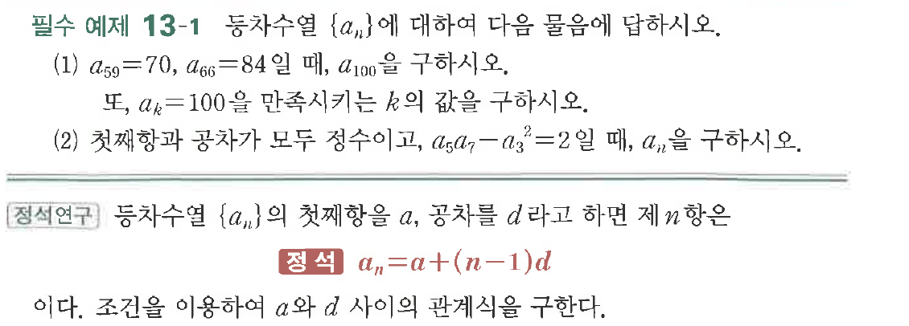
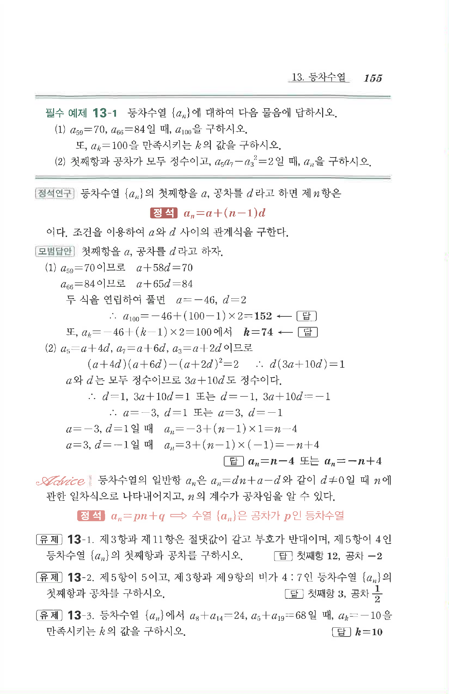

# 필수 예제 13-1

## 문제

등차수열 $\{a_n\}$에 대하여 다음 물음에 답하시오.

(1) $a_{59}=70$, $a_{66}=84$일 때, $a_{100}$을 구하시오.

또, $a_k=100$을 만족시키는 $k$의 값을 구하시오.

(2) 첫째항과 공차가 모두 정수이고, $a_5a_7-a_3^2=2$일 때, $a_n$을 구하시오.

## 원문 문제

## 원문

