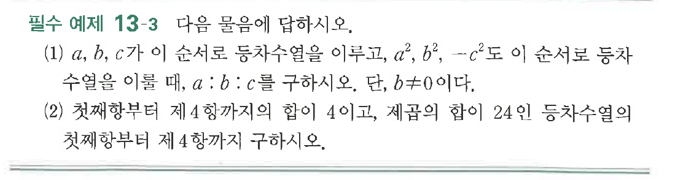
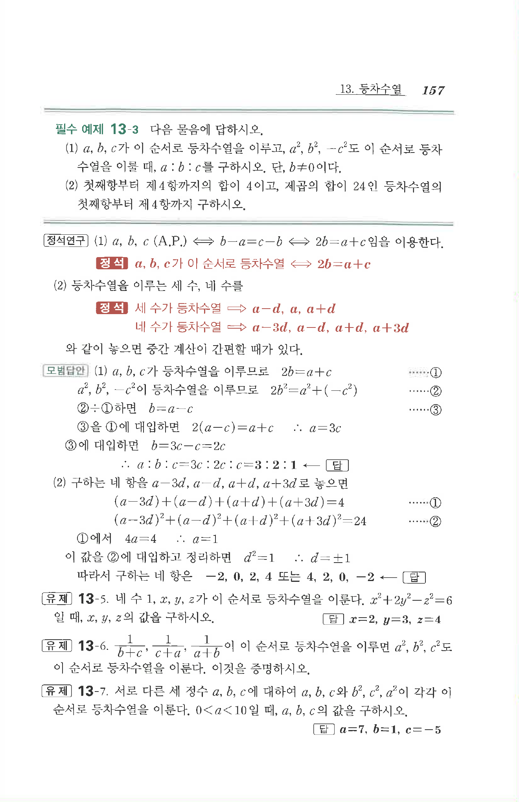

# 필수 예제 13-3

## 문제

다음 물음에 답하시오.

(1) $a$, $b$, $c$가 이 순서로 등차수열을 이루고, $a^2$, $b^2$, $-c^2$도 이 순서로 등차수열을 이룰 때, $a:b:c$를 구하시오. 단, $b\ne 0$이다.

(2) 첫째항부터 제$4$항까지의 합이 $4$이고, 제곱의 합이 $24$인 등차수열의 첫째항부터 제$4$항까지 구하시오.

## 원문 문제

## 원문

