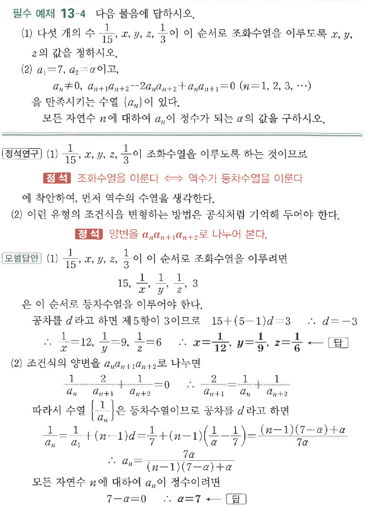
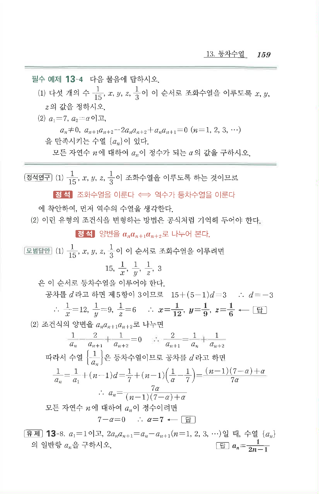

# 필수 예제 13-4

## 문제

다음 물음에 답하시오.

(1) 다섯 개의 수 $\dfrac{1}{15}$, $x$, $y$, $z$, $\dfrac{1}{3}$이 이 순서로 조화수열을 이루도록 $x$, $y$, $z$의 값을 정하시오.

(2) $a_1=7$, $a_2=a$이고,

$$a_n\ne 0,\quad a_{n+1}a_{n+2}-2a_na_{n+2}+a_na_{n+1}=0\quad(n=1,2,3,\cdots)$$

을 만족시키는 수열 $\{a_n\}$이 있다. 모든 자연수 $n$에 대하여 $a_n$이 정수가 되는 $a$의 값을 구하시오.

## 원문 문제

## 원문

