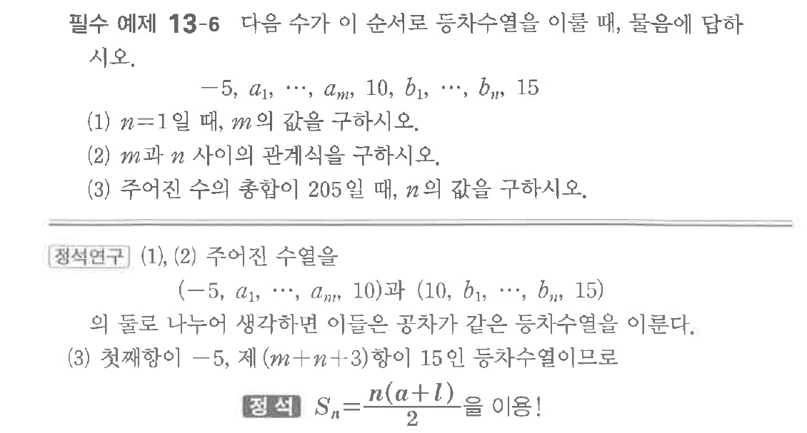
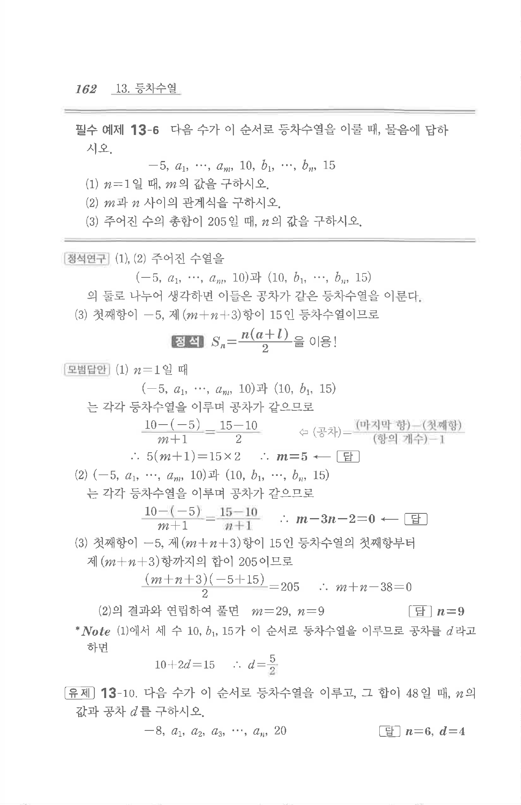

# 필수 예제 13-6

## 문제

다음 수가 이 순서로 등차수열을 이룰 때, 물음에 답하시오.

$$-5,\ a_1,\ \cdots,\ a_m,\ 10,\ b_1,\ \cdots,\ b_n,\ 15$$

(1) $n=1$일 때, $m$의 값을 구하시오.

(2) $m$과 $n$ 사이의 관계식을 구하시오.

(3) 주어진 수의 총합이 $205$일 때, $n$의 값을 구하시오.

## 원문 문제

## 원문

