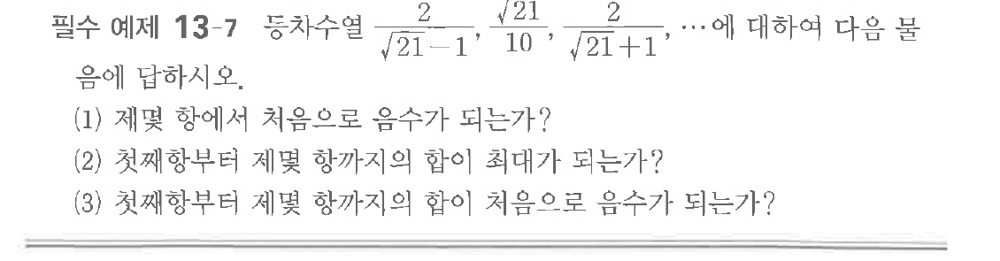

# 필수 예제 13-7

## 문제

등차수열

$$\dfrac{2}{\sqrt{21}-1},\quad \dfrac{\sqrt{21}}{10},\quad \dfrac{2}{\sqrt{21}+1},\quad \cdots$$

에 대하여 다음 물음에 답하시오.

(1) 제몇 항에서 처음으로 음수가 되는가?

(2) 첫째항부터 제몇 항까지의 합이 최대가 되는가?

(3) 첫째항부터 제몇 항까지의 합이 처음으로 음수가 되는가?

## 원문 문제

## 원문

