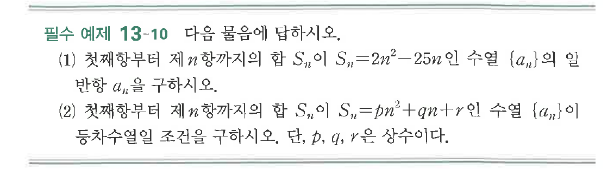

# 필수 예제 13-10

## 문제

다음 물음에 답하시오.

(1) 첫째항부터 제$n$항까지의 합 $S_n$이 $S_n=2n^2-25n$인 수열 $\{a_n\}$의 일반항 $a_n$을 구하시오.

(2) 첫째항부터 제$n$항까지의 합 $S_n$이 $S_n=pn^2+qn+r$인 수열 $\{a_n\}$이 등차수열일 조건을 구하시오. 단, $p$, $q$, $r$은 상수이다.

## 원문 문제

## 원문

