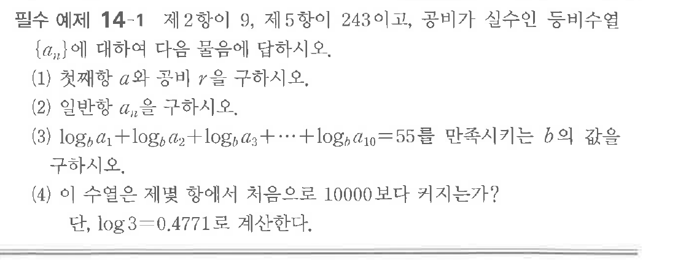

# 필수 예제 14-1

## 문제

제$2$항이 $9$, 제$5$항이 $243$이고, 공비가 실수인 등비수열 $\{a_n\}$에 대하여 다음 물음에 답하시오.

(1) 첫째항 $a$와 공비 $r$을 구하시오.

(2) 일반항 $a_n$을 구하시오.

(3) $\log_b a_1+\log_b a_2+\log_b a_3+\cdots+\log_b a_{10}=55$를 만족시키는 $b$의 값을 구하시오.

(4) 이 수열은 제몇 항에서 처음으로 $10000$보다 커지는가?

단, $\log3=0.4771$로 계산한다.

## 원문 문제

## 원문

