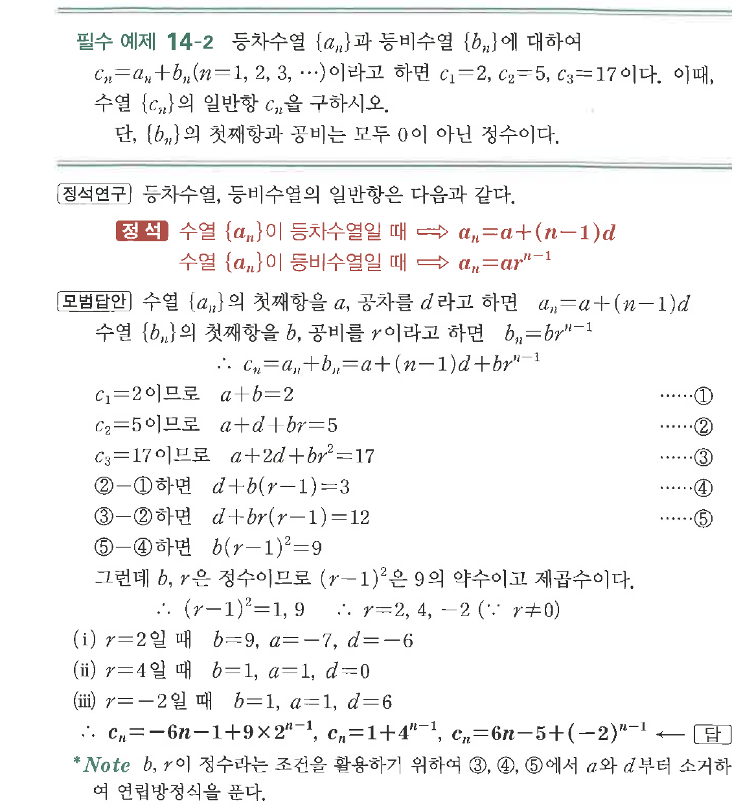

# 필수 예제 14-2

## 문제

등차수열 $\{a_n\}$과 등비수열 $\{b_n\}$에 대하여

$$c_n=a_n+b_n\quad(n=1,2,3,\cdots)$$

이라고 하면 $c_1=2$, $c_2=5$, $c_3=17$이다. 이때 수열 $\{c_n\}$의 일반항 $c_n$을 구하시오.

단, $\{b_n\}$의 첫째항과 공비는 모두 $0$이 아닌 정수이다.

## 원문 문제

## 원문

