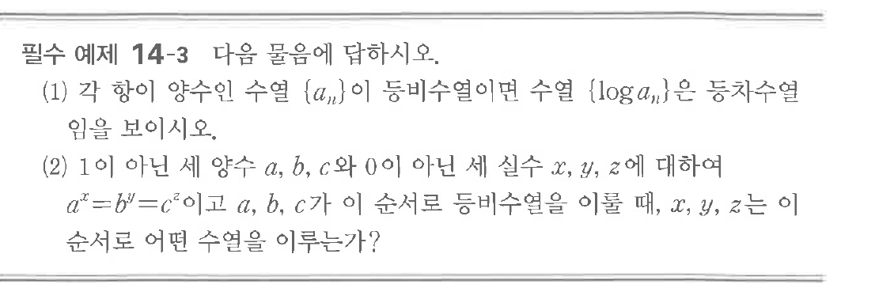

# 필수 예제 14-3

## 문제

다음 물음에 답하시오.

(1) 각 항이 양수인 수열 $\{a_n\}$이 등비수열이면 수열 $\{\log a_n\}$은 등차수열임을 보이시오.

(2) $1$이 아닌 세 양수 $a$, $b$, $c$와 $0$이 아닌 세 실수 $x$, $y$, $z$에 대하여 $a^x=b^y=c^z$이고 $a$, $b$, $c$가 이 순서로 등비수열을 이룰 때, $x$, $y$, $z$는 이 순서로 어떤 수열을 이루는가?

## 원문 문제

## 원문

