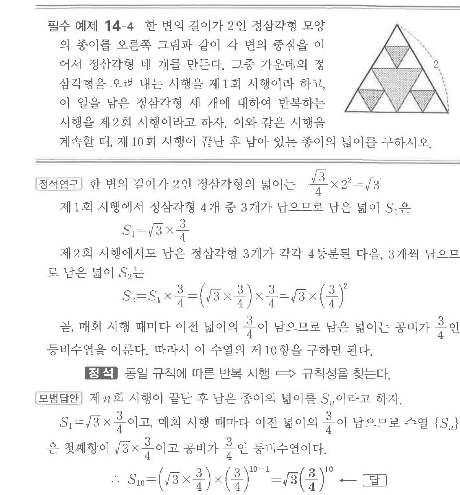

# 필수 예제 14-4

## 문제

한 변의 길이가 $2$인 정삼각형 모양의 종이를 오른쪽 그림과 같이 각 변의 중점을 이어서 정삼각형 네 개를 만든다. 그중 가운데의 정삼각형을 오려 내는 시행을 제$1$회 시행이라 하고, 이 일을 남은 정삼각형 세 개에 대하여 반복하는 시행을 제$2$회 시행이라고 하자. 이와 같은 시행을 계속할 때, 제$10$회 시행이 끝난 후 남아 있는 종이의 넓이를 구하시오.

## 원문 문제

## 원문

