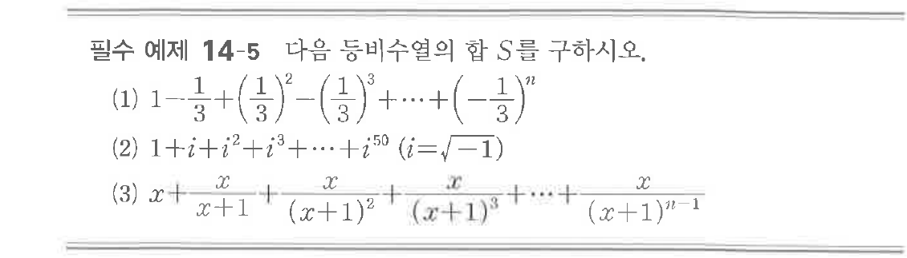

# 필수 예제 14-5

## 문제

다음 등비수열의 합 $S$를 구하시오.

(1) $1-\dfrac{1}{3}+\left(\dfrac{1}{3}\right)^2-\left(\dfrac{1}{3}\right)^3+\cdots+\left(-\dfrac{1}{3}\right)^n$

(2) $1+i+i^2+i^3+\cdots+i^{50}\quad(i=\sqrt{-1})$

(3) $x+\dfrac{x}{x+1}+\dfrac{x}{(x+1)^2}+\dfrac{x}{(x+1)^3}+\cdots+\dfrac{x}{(x+1)^{n-1}}$

## 원문 문제

## 원문

