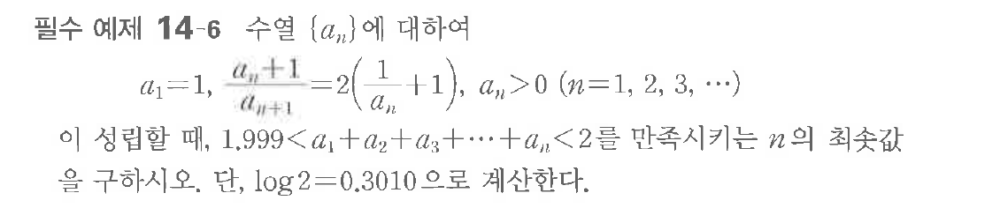

# 필수 예제 14-6

## 문제

수열 $\{a_n\}$에 대하여

$$a_1=1,\quad \dfrac{a_n+1}{a_{n+1}}=2\left(\dfrac{1}{a_n}+1\right),\quad a_n>0\quad(n=1,2,3,\cdots)$$

이 성립할 때, $1.999<a_1+a_2+a_3+\cdots+a_n<2$를 만족시키는 $n$의 최솟값을 구하시오. 단, $\log2=0.3010$으로 계산한다.

## 원문 문제

## 원문

