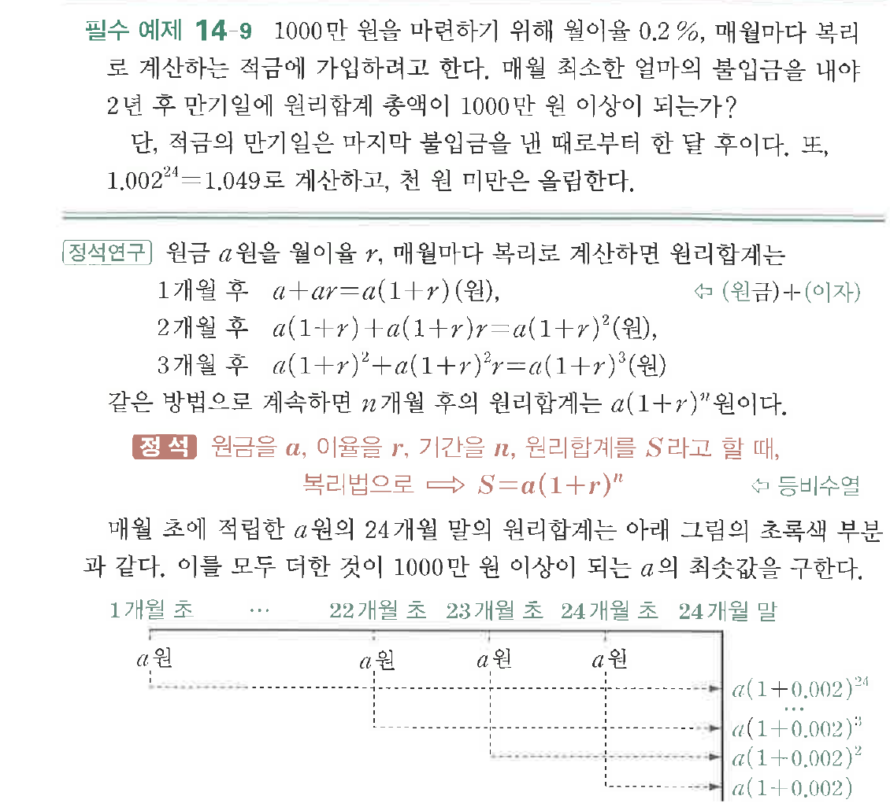
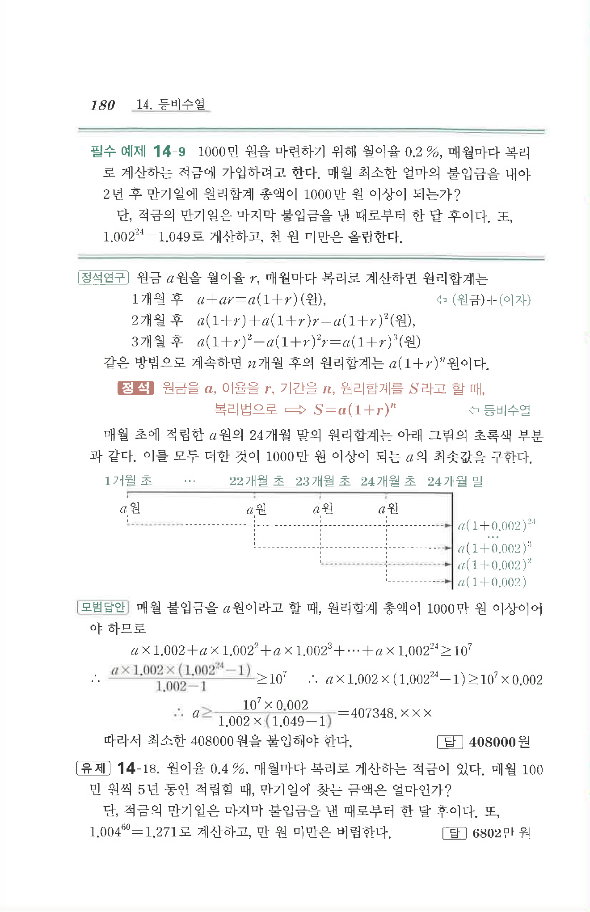

# 필수 예제 14-9

## 문제

$1000$만 원을 마련하기 위해 월이율 $0.2\%$, 매월마다 복리로 계산하는 적금에 가입하려고 한다. 매월 최소한 얼마의 불입금을 내야 $2$년 후 만기일에 원리합계 총액이 $1000$만 원 이상이 되는가?

단, 적금의 만기일은 마지막 불입금을 낸 때로부터 한 달 후이다. 또, $1.002^{24}=1.049$로 계산하고, 천 원 미만은 올림한다.

## 원문 문제

## 원문

