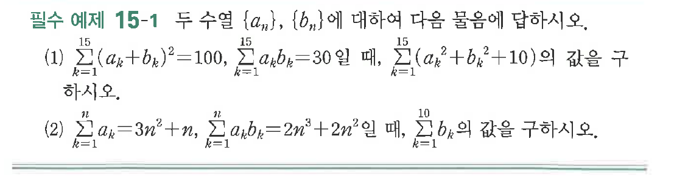
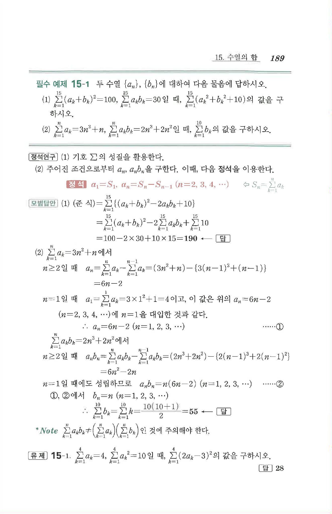

# 필수 예제 15-1

## 문제

두 수열 $\{a_n\}$, $\{b_n\}$에 대하여 다음 물음에 답하시오.

(1) $\displaystyle\sum_{k=1}^{15}(a_k+b_k)^2=100$, $\displaystyle\sum_{k=1}^{15}a_kb_k=30$일 때, $\displaystyle\sum_{k=1}^{15}(a_k^2+b_k^2+10)$의 값을 구하시오.

(2) $\displaystyle\sum_{k=1}^{n}a_k=3n^2+n$, $\displaystyle\sum_{k=1}^{n}a_kb_k=2n^3+2n^2$일 때, $\displaystyle\sum_{k=1}^{10}b_k$의 값을 구하시오.

## 원문 문제

## 원문

