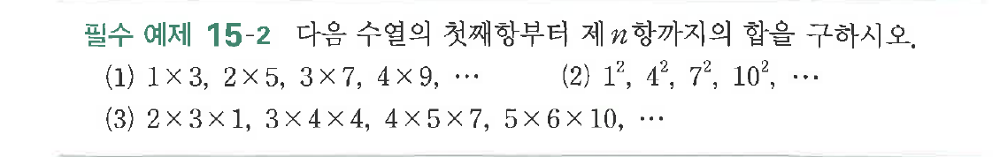

# 필수 예제 15-2

## 문제

다음 수열의 첫째항부터 제$n$항까지의 합을 구하시오.

(1) $1\times3,\ 2\times5,\ 3\times7,\ 4\times9,\ \cdots$

(2) $1^2,\ 4^2,\ 7^2,\ 10^2,\ \cdots$

(3) $2\times3\times1,\ 3\times4\times4,\ 4\times5\times7,\ 5\times6\times10,\ \cdots$

## 원문 문제

## 원문

