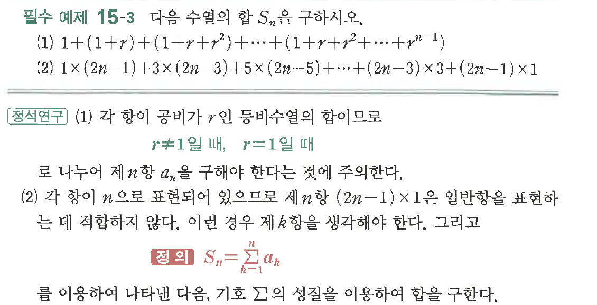

# 필수 예제 15-3

## 문제

다음 수열의 합 $S_n$을 구하시오.

(1) $1+(1+r)+(1+r+r^2)+\cdots+(1+r+r^2+\cdots+r^{n-1})$

(2) $1\times(2n-1)+3\times(2n-3)+5\times(2n-5)+\cdots+(2n-3)\times3+(2n-1)\times1$

## 원문 문제

## 원문

