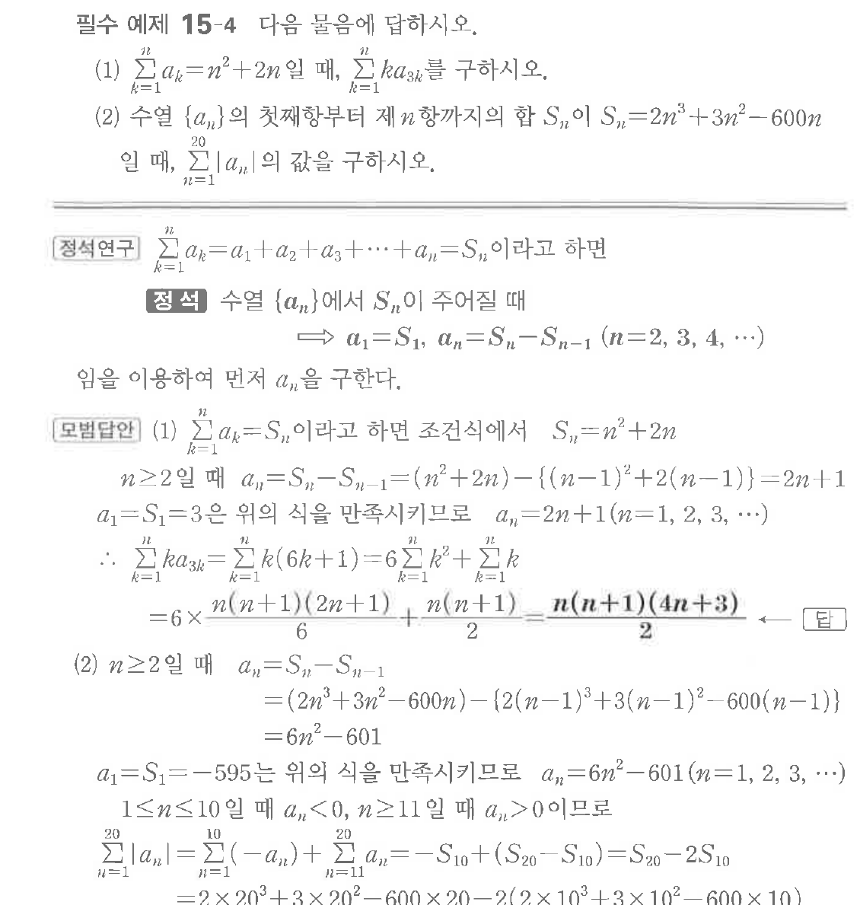
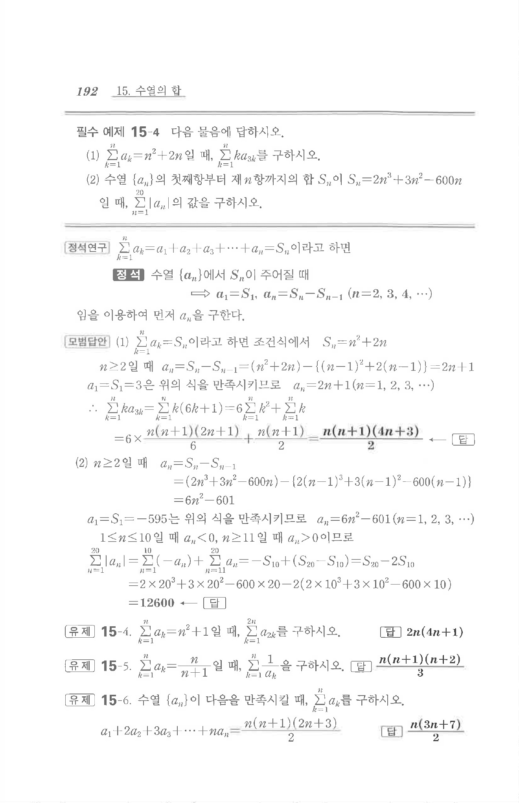

# 필수 예제 15-4

## 문제

다음 물음에 답하시오.

(1) $\displaystyle\sum_{k=1}^{n}a_k=n^2+2n$일 때, $\displaystyle\sum_{k=1}^{n}ka_{3k}$를 구하시오.

(2) 수열 $\{a_n\}$의 첫째항부터 제$n$항까지의 합 $S_n$이 $S_n=2n^3+3n^2-600n$일 때, $\displaystyle\sum_{n=1}^{20}|a_n|$의 값을 구하시오.

## 원문 문제

## 원문

