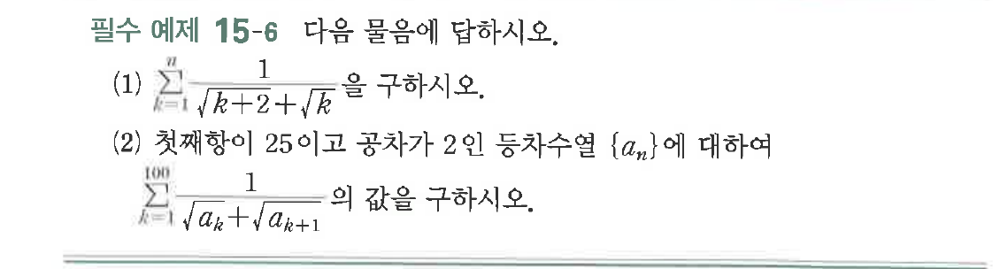
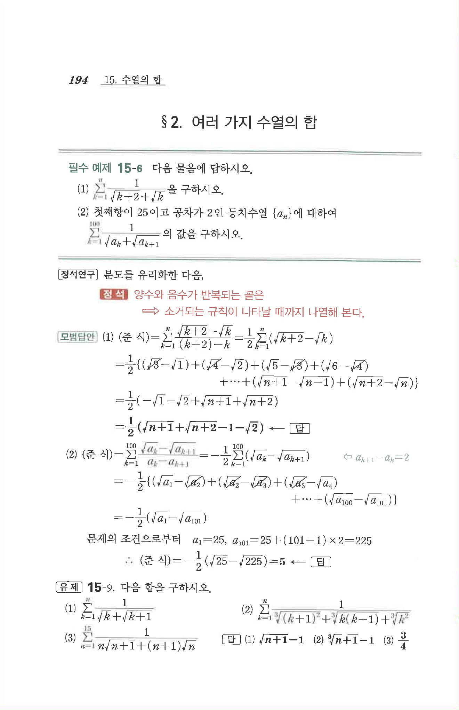

# 필수 예제 15-6

## 문제

다음 물음에 답하시오.

(1) $\displaystyle\sum_{k=1}^{n}\dfrac{1}{\sqrt{k+2}+\sqrt{k}}$을 구하시오.

(2) 첫째항이 $25$이고 공차가 $2$인 등차수열 $\{a_n\}$에 대하여 $\displaystyle\sum_{k=1}^{100}\dfrac{1}{\sqrt{a_k}+\sqrt{a_{k+1}}}$의 값을 구하시오.

## 원문 문제

## 원문

