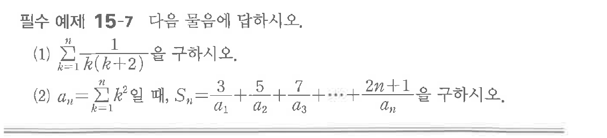
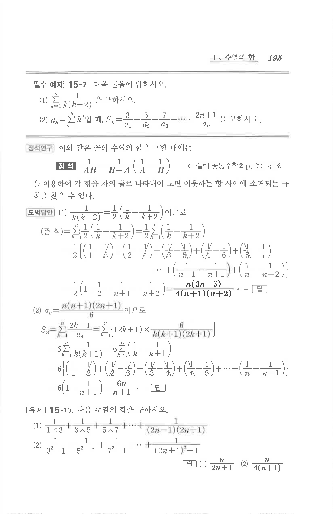

# 필수 예제 15-7

## 문제

다음 물음에 답하시오.

(1) $\displaystyle\sum_{k=1}^{n}\dfrac{1}{k(k+2)}$을 구하시오.

(2) $a_n=\displaystyle\sum_{k=1}^{n}k^2$일 때, $S_n=\dfrac{3}{a_1}+\dfrac{5}{a_2}+\dfrac{7}{a_3}+\cdots+\dfrac{2n+1}{a_n}$을 구하시오.

## 원문 문제

## 원문

