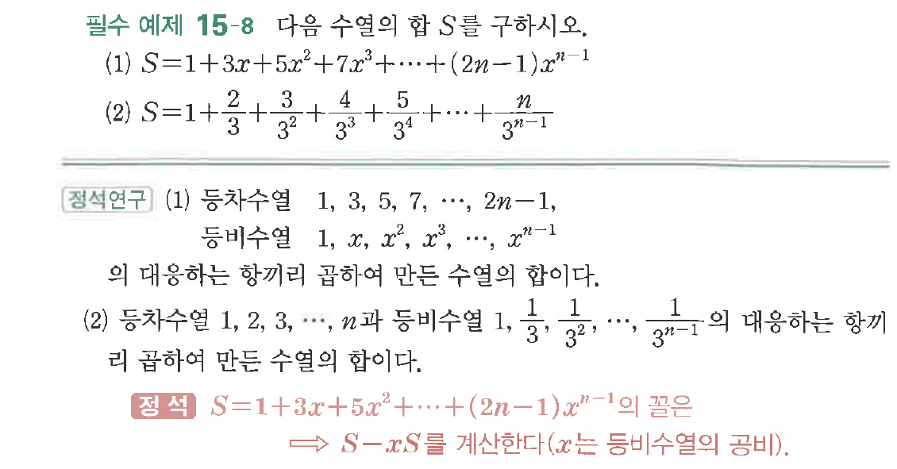

# 필수 예제 15-8

## 문제

다음 수열의 합 $S$를 구하시오.

(1) $S=1+3x+5x^2+7x^3+\cdots+(2n-1)x^{n-1}$

(2) $S=1+\dfrac{2}{3}+\dfrac{3}{3^2}+\dfrac{4}{3^3}+\dfrac{5}{3^4}+\cdots+\dfrac{n}{3^{n-1}}$

## 원문 문제

## 원문

