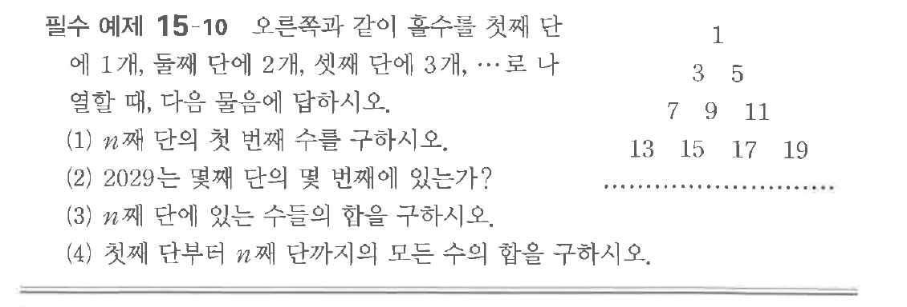
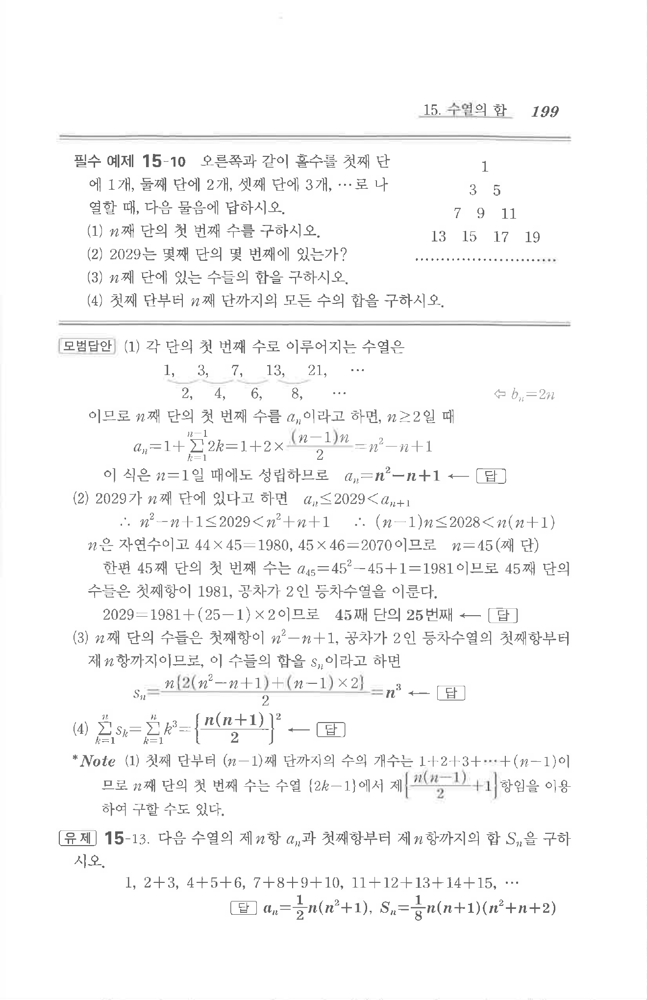

# 필수 예제 15-10

## 문제

오른쪽과 같이 홀수를 첫째 단에 1개, 둘째 단에 2개, 셋째 단에 3개, $\cdots$로 나열할 때, 다음 물음에 답하시오.

(1) $n$째 단의 첫 번째 수를 구하시오.

(2) $2029$는 몇째 단의 몇 번째에 있는가?

(3) $n$째 단에 있는 수들의 합을 구하시오.

(4) 첫째 단부터 $n$째 단까지의 모든 수의 합을 구하시오.

## 원문 문제

## 원문

