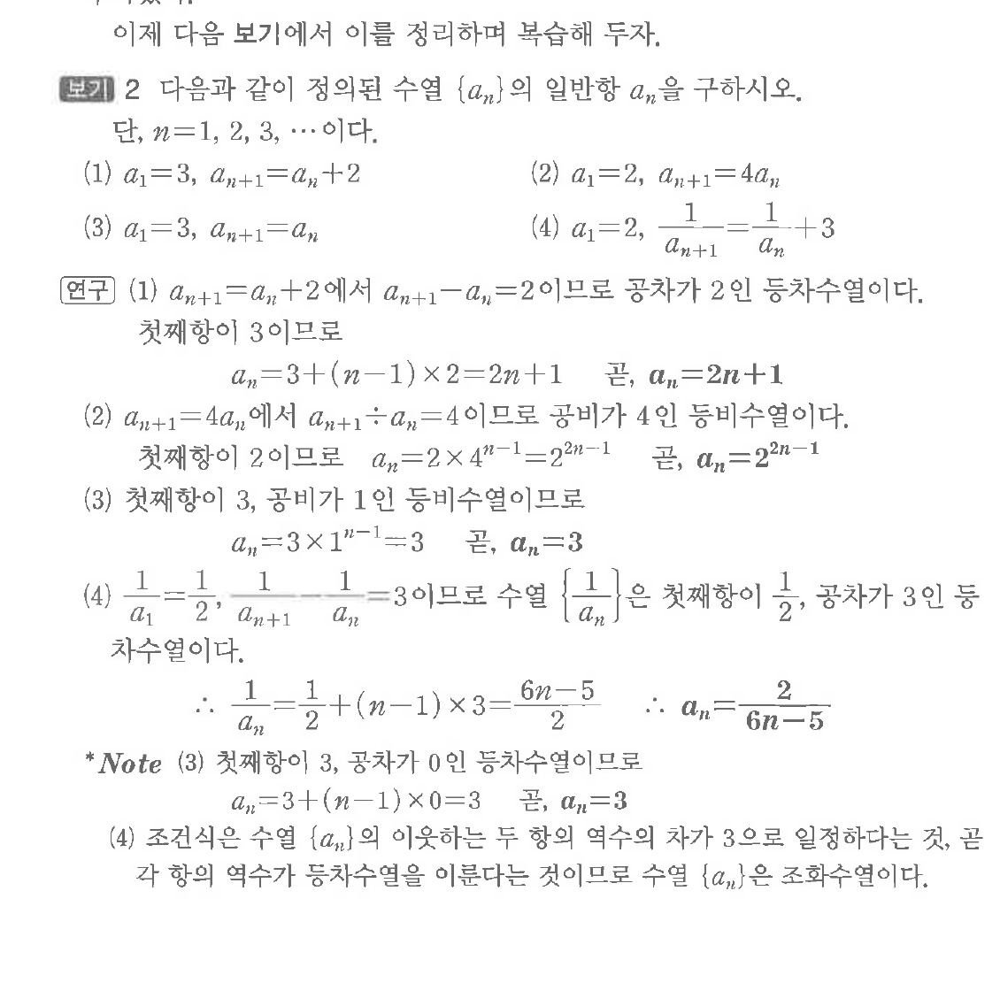
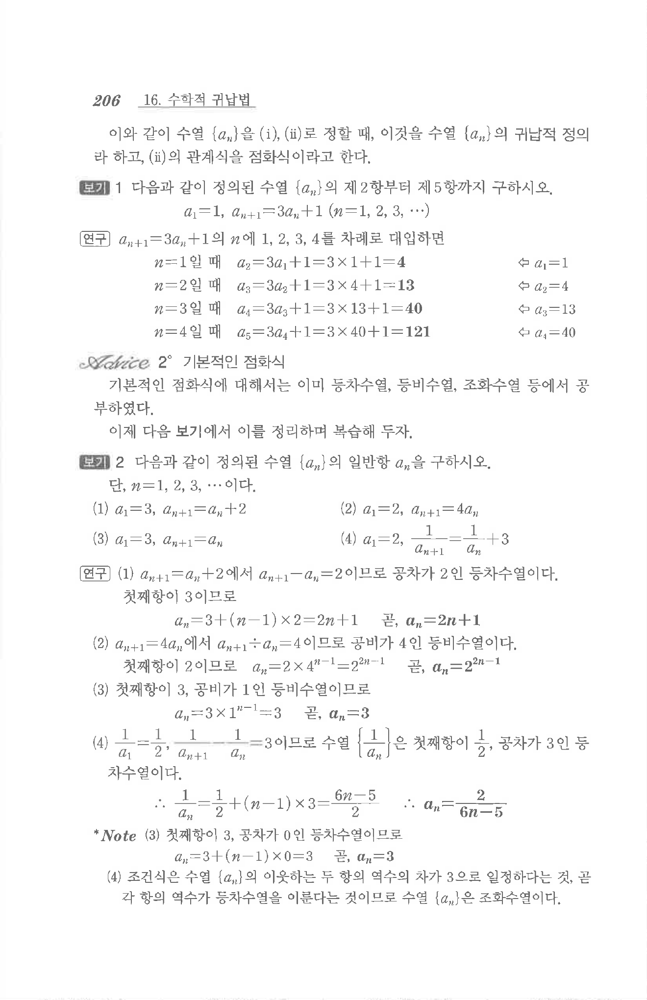

# S1 보기 1

## 문제

다음과 같이 정의된 수열 $\{a_n\}$의 일반항 $a_n$을 구하시오. 단, $n=1,2,3,\cdots$이다.

(1) $a_1=3,\ a_{n+1}=a_n+2$

(2) $a_1=2,\ a_{n+1}=4a_n$

(3) $a_1=3,\ a_{n+1}=a_n$

(4) $a_1=2,\ \dfrac{1}{a_{n+1}}=\dfrac{1}{a_n}+3$

## 원문 문제

## 원문

