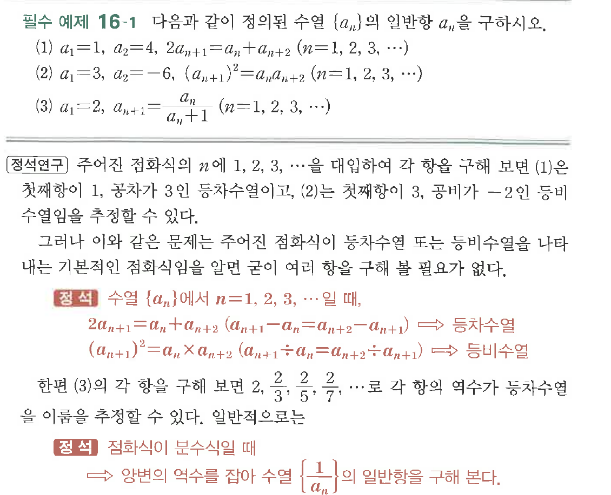
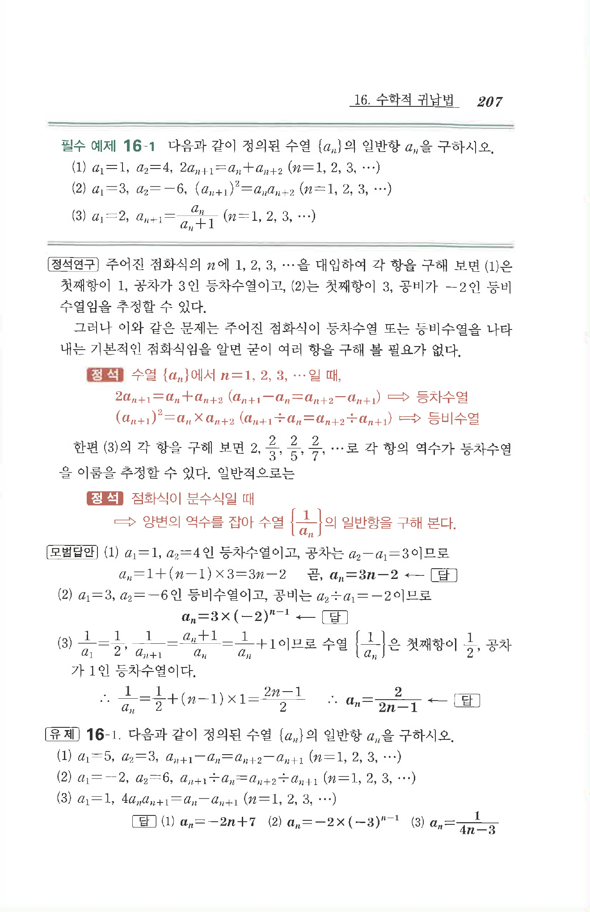

# 필수 예제 16-1

## 문제

다음과 같이 정의된 수열 $\{a_n\}$의 일반항 $a_n$을 구하시오.

(1) $a_1=1,\ a_2=4,\ 2a_{n+1}=a_n+a_{n+2}\quad(n=1,2,3,\cdots)$

(2) $a_1=3,\ a_2=-6,\ (a_{n+1})^2=a_na_{n+2}\quad(n=1,2,3,\cdots)$

(3) $a_1=2,\ a_{n+1}=\dfrac{a_n}{a_n+1}\quad(n=1,2,3,\cdots)$

## 원문 문제

## 원문

