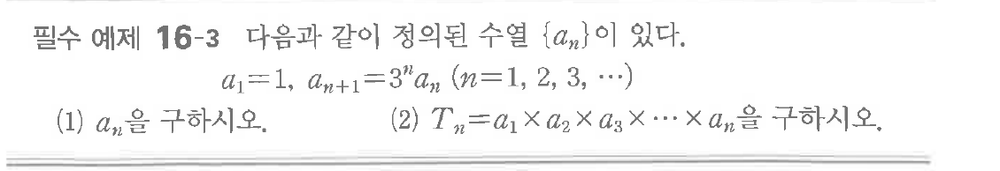
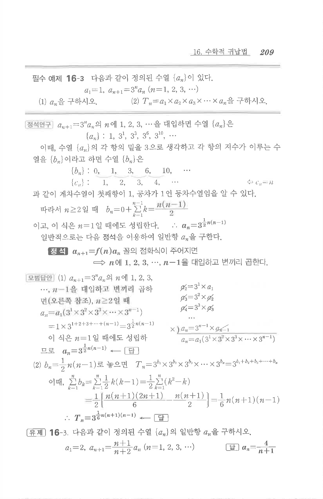

# 필수 예제 16-3

## 문제

다음과 같이 정의된 수열 $\{a_n\}$이 있다.

$$
a_1=1,\quad a_{n+1}=3^n a_n\quad(n=1,2,3,\cdots)
$$

(1) $a_n$을 구하시오.

(2) $T_n=a_1\times a_2\times a_3\times\cdots\times a_n$을 구하시오.

## 원문 문제

## 원문

