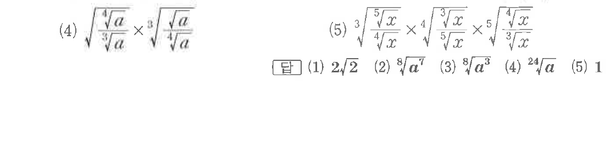

# 유제 1-1

## 문제

다음을 간단히 하시오. 단, $a>0$, $x>0$이다.

(1) $\sqrt[4]{17+2\sqrt{72}}+\sqrt[4]{17-2\sqrt{72}}$

(2) $\sqrt{a\sqrt{a\sqrt a}}$

(3) $\sqrt[4]{a\sqrt[3]{a\sqrt a}}$

(4) $\sqrt{\dfrac{\sqrt[4]{a}}{\sqrt[3]{a}}}\times\sqrt[3]{\dfrac{\sqrt a}{\sqrt[4]{a}}}$

(5) $\sqrt[3]{\dfrac{\sqrt[5]{x}}{\sqrt[4]{x}}}\times\sqrt[4]{\dfrac{\sqrt[3]{x}}{\sqrt[5]{x}}}\times\sqrt[5]{\dfrac{\sqrt[4]{x}}{\sqrt[3]{x}}}$

## 정답

(1) $2\sqrt2$  
(2) $\sqrt[8]{a^7}$  
(3) $\sqrt[8]{a^3}$  
(4) $\sqrt[24]{a}$  
(5) $1$

## 원문 문제

## 원문

