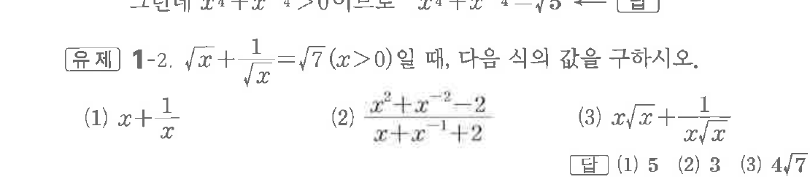
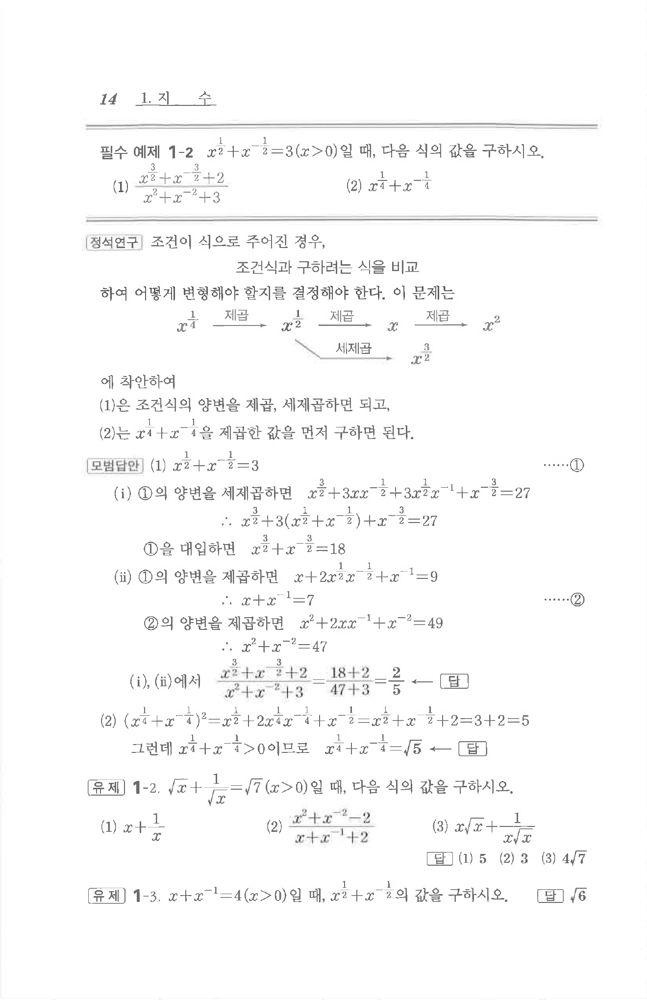

# 유제 1-2

## 문제

$\sqrt{x}+\dfrac1{\sqrt{x}}=\sqrt7$ $(x>0)$일 때, 다음 식의 값을 구하시오.

(1) $x+\dfrac1x$

(2) $\dfrac{x^2+x^{-2}-2}{x+x^{-1}+2}$

(3) $x\sqrt{x}+\dfrac1{x\sqrt{x}}$

## 정답

(1) $5$  
(2) $3$  
(3) $4\sqrt7$

## 원문 문제

## 원문

