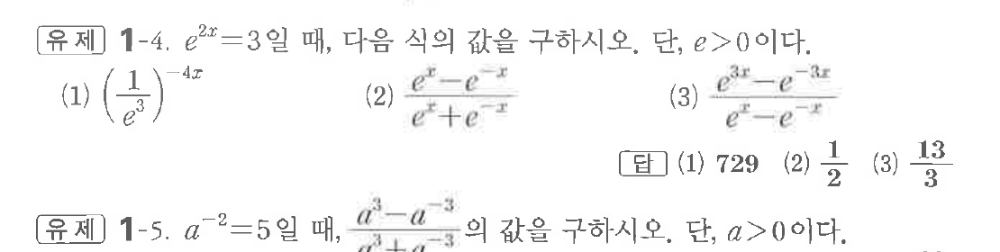
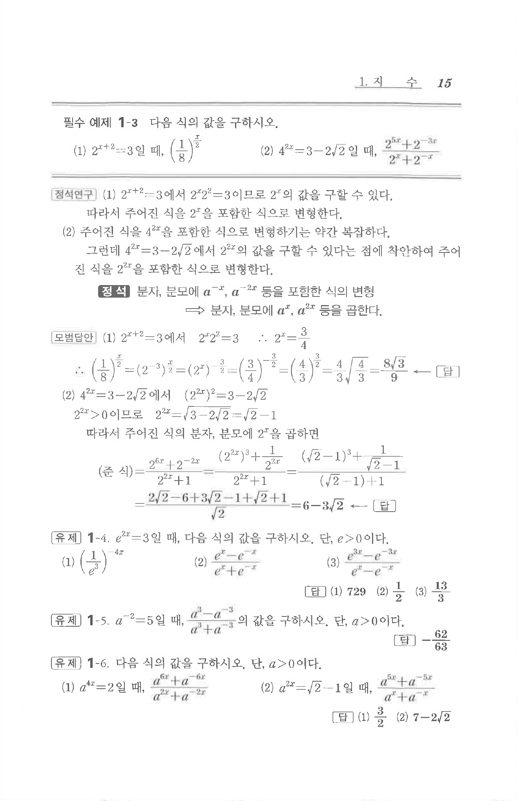

# 유제 1-4

## 문제

$e^{2x}=3$일 때, 다음 식의 값을 구하시오. 단, $e>0$이다.

(1) $\left(\dfrac1{e^3}\right)^{-4x}$

(2) $\dfrac{e^x-e^{-x}}{e^x+e^{-x}}$

(3) $\dfrac{e^{3x}-e^{-3x}}{e^x-e^{-x}}$

## 정답

(1) $729$  
(2) $\dfrac12$  
(3) $\dfrac{13}{3}$

## 원문 문제

## 원문

