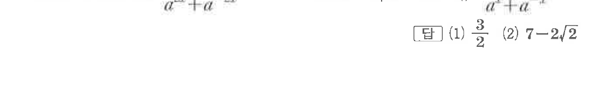

# 유제 1-6

## 문제

다음 식의 값을 구하시오. 단, $a>0$이다.

(1) $a^{4x}=2$일 때, $\dfrac{a^{6x}+a^{-6x}}{a^{2x}+a^{-2x}}$

(2) $a^{2x}=\sqrt2-1$일 때, $\dfrac{a^{5x}+a^{-5x}}{a^x+a^{-x}}$

## 정답

(1) $\dfrac32$  
(2) $7-2\sqrt2$

## 원문 문제

## 원문

