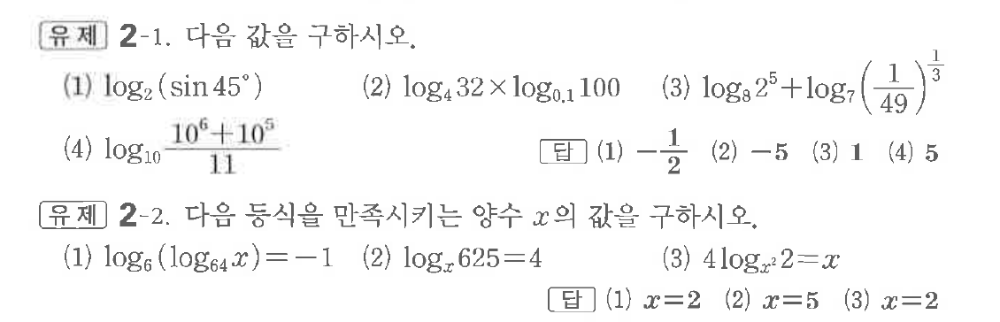
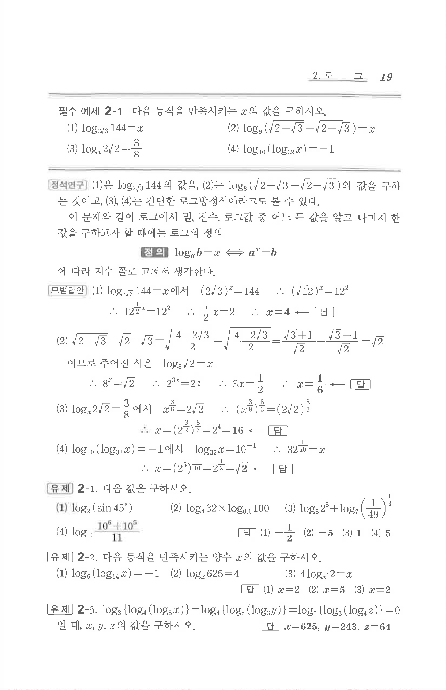

# 유제 2-1

## 문제

다음 값을 구하시오.

(1) $\log_2(\sin45^\circ)$

(2) $\log_4 32\times\log_{0.1}100$

(3) $\log_8 2^5+\log_7\left(\dfrac1{49}\right)^{\frac13}$

(4) $\log_{10}\dfrac{10^6+10^5}{11}$

다음 등식을 만족시키는 양수 $x$의 값을 구하시오.

(1) $\log_6(\log_{64}x)=-1$

(2) $\log_x625=4$

(3) $4\log_{x^2}2=x$

## 정답

첫 번째 문제: (1) $-\dfrac12$  (2) $-5$  (3) $1$  (4) $5$

두 번째 문제: (1) $x=2$  (2) $x=5$  (3) $x=2$

## 원문 문제

## 원문

