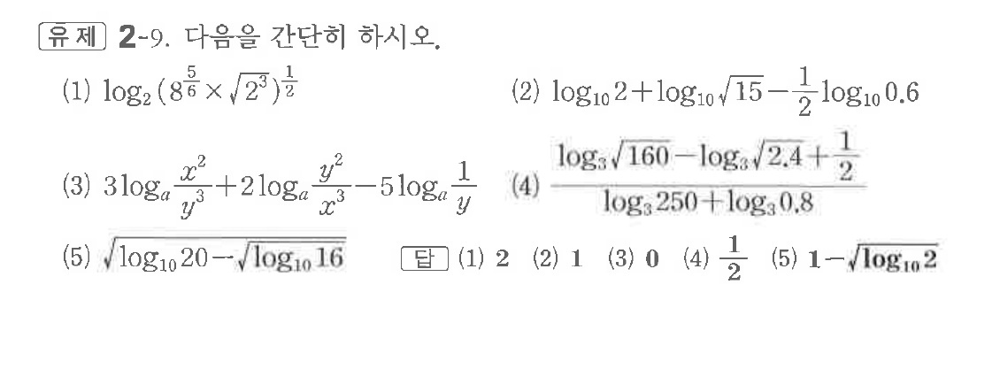

# 유제 2-9

## 문제

다음을 간단히 하시오.

(1) $\log_2\left(8^{\frac56}\times\sqrt{2^3}\right)^{\frac12}$

(2) $\log_{10}2+\log_{10}\sqrt{15}-\dfrac12\log_{10}0.6$

(3) $3\log_a\dfrac{x^2}{y^3}+2\log_a\dfrac{y^2}{x^3}-5\log_a\dfrac1y$

(4) $\dfrac{\log_3\sqrt{160}-\log_3\sqrt{2.4}+\dfrac12}{\log_3250+\log_30.8}$

(5) $\sqrt{\log_{10}20-\sqrt{\log_{10}16}}$

## 정답

(1) $2$  
(2) $1$  
(3) $0$  
(4) $\dfrac12$  
(5) $1-\sqrt{\log_{10}2}$

## 원문 문제

## 원문

