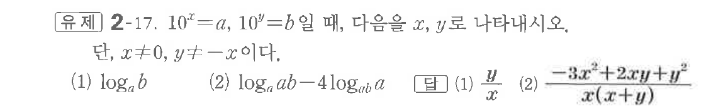

# 유제 2-17

## 문제

$10^x=a,\ 10^y=b$일 때, 다음을 $x,\ y$로 나타내시오. 단, $x\ne0,\ y\ne -x$이다.

(1) $\log_a b$

(2) $\log_a ab-4\log_{ab}a$

## 정답

(1) $\dfrac yx$  
(2) $\dfrac{-3x^2+2xy+y^2}{x(x+y)}$

## 원문 문제

## 원문

