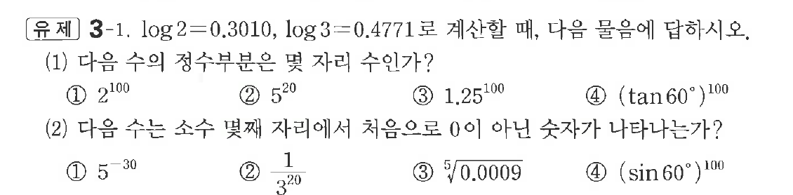

# 유제 3-1

## 문제

$\log2=0.3010,\ \log3=0.4771$로 계산할 때, 다음 물음에 답하시오.

(1) 다음 수의 정수부분은 몇 자리 수인가?

① $2^{100}$  
② $5^{20}$  
③ $1.25^{100}$  
④ $(\tan60^\circ)^{100}$

(2) 다음 수는 소수 몇째 자리에서 처음으로 $0$이 아닌 숫자가 나타나는가?

① $5^{-30}$  
② $\dfrac1{3^{20}}$  
③ $\sqrt[5]{0.0009}$  
④ $(\sin60^\circ)^{100}$

## 정답

(1) ① $31$자리  ② $14$자리  ③ $10$자리  ④ $24$자리

(2) ① 소수 $21$째 자리  ② 소수 $10$째 자리  ③ 소수 $1$째 자리  ④ 소수 $7$째 자리

## 원문 문제

## 원문

