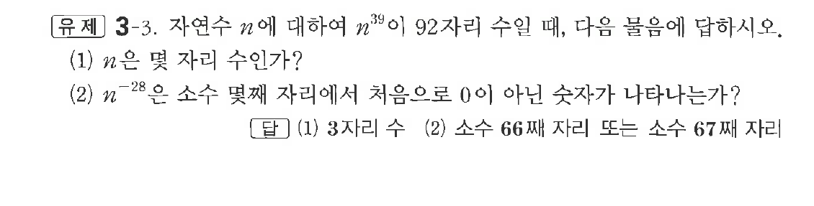

# 유제 3-3

## 문제

자연수 $n$에 대하여 $n^{39}$이 $92$자리 수일 때, 다음 물음에 답하시오.

(1) $n$은 몇 자리 수인가?

(2) $n^{-28}$은 소수 몇째 자리에서 처음으로 $0$이 아닌 숫자가 나타나는가?

## 정답

(1) $3$자리 수  
(2) 소수 $66$째 자리 또는 소수 $67$째 자리

## 원문 문제

## 원문

