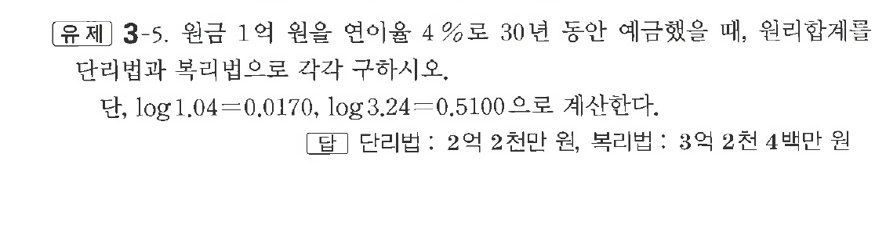

# 유제 3-5

## 문제

원금 $1$억 원을 연이율 $4\%$로 $30$년 동안 예금했을 때, 원리합계를 단리법과 복리법으로 각각 구하시오.

단, $\log1.04=0.0170,\ \log3.24=0.5100$으로 계산한다.

## 정답

단리법: $2$억 $2$천만 원, 복리법: $3$억 $2$천 $4$백만 원

## 원문 문제

## 원문

