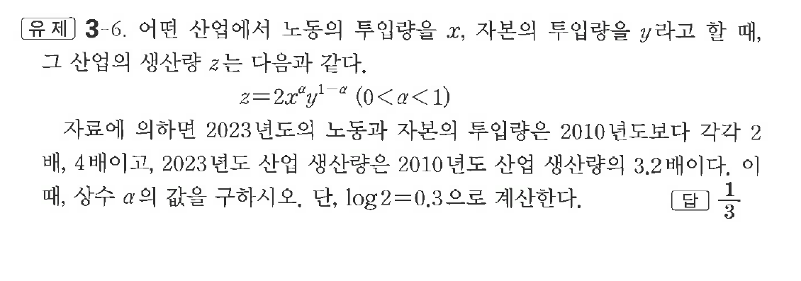

# 유제 3-6

## 문제

어떤 산업에서 노동의 투입량을 $x$, 자본의 투입량을 $y$라고 할 때, 그 산업의 생산량 $z$는 다음과 같다.

$$
z=2x^a y^{1-a}\quad(0<a<1)
$$

자료에 의하면 $2023$년도의 노동과 자본의 투입량은 $2010$년도보다 각각 $2$배, $4$배이고, $2023$년도 산업 생산량은 $2010$년도 산업 생산량의 $3.2$배이다. 이때, 상수 $a$의 값을 구하시오. 단, $\log2=0.3$으로 계산한다.

## 정답

$\dfrac13$

## 원문 문제

## 원문

