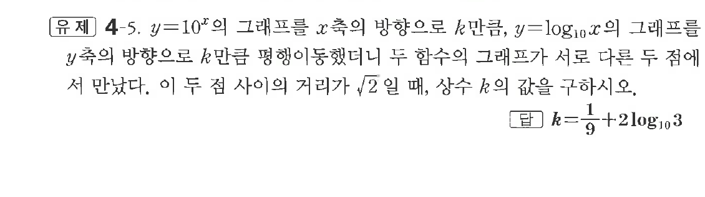
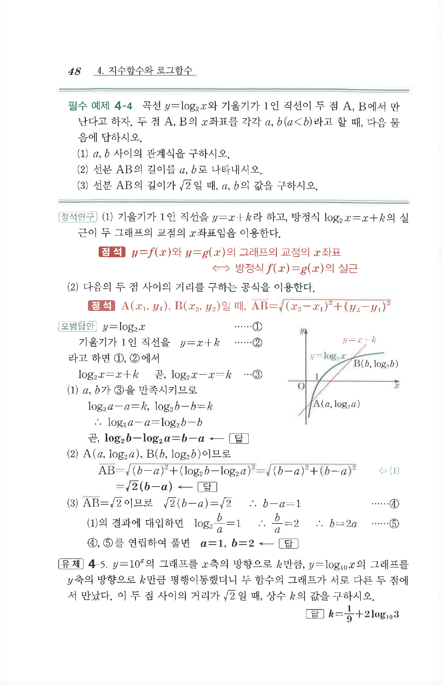

# 유제 4-5

## 문제

$y=10^x$의 그래프를 $x$축의 방향으로 $k$만큼, $y=\log_{10}x$의 그래프를 $y$축의 방향으로 $k$만큼 평행이동했더니 두 함수의 그래프가 서로 다른 두 점에서 만났다. 이 두 점 사이의 거리가 $\sqrt2$일 때, 상수 $k$의 값을 구하시오.

## 정답

$k=\dfrac19+2\log_{10}3$

## 원문 문제

## 원문

