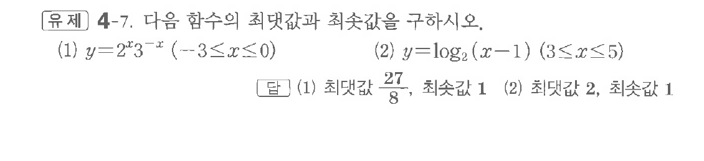
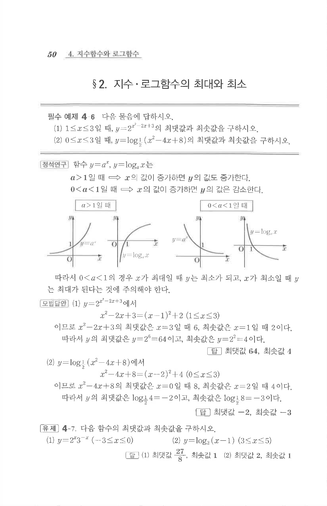

# 유제 4-7

## 문제

다음 함수의 최댓값과 최솟값을 구하시오.

(1) $y=2^x3^{-x}\quad(-3\le x\le0)$

(2) $y=\log_2(x-1)\quad(3\le x\le5)$

## 정답

(1) 최댓값 $\dfrac{27}{8}$, 최솟값 $1$  
(2) 최댓값 $2$, 최솟값 $1$

## 원문 문제

## 원문

