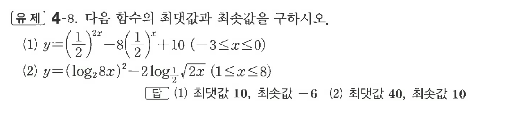

# 유제 4-8

## 문제

다음 함수의 최댓값과 최솟값을 구하시오.

(1) $y=\left(\dfrac12\right)^{2x}-8\left(\dfrac12\right)^x+10\quad(-3\le x\le0)$

(2) $y=(\log_2 8x)^2-2\log_{\frac12}\sqrt{2x}\quad(1\le x\le8)$

## 정답

(1) 최댓값 $10$, 최솟값 $-6$  
(2) 최댓값 $40$, 최솟값 $10$

## 원문 문제

## 원문

