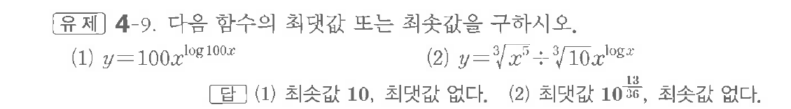
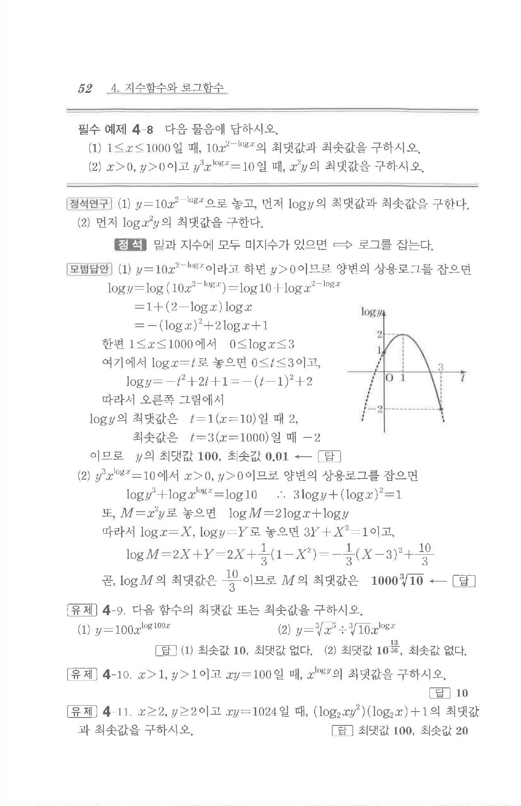

# 유제 4-9

## 문제

다음 함수의 최댓값 또는 최솟값을 구하시오.

(1) $y=100x^{\log100x}$

(2) $y=\sqrt[3]{x}\cdot\sqrt[3]{10x^{\log x}}$

## 정답

(1) 최솟값 $10$, 최댓값 없다.  
(2) 최댓값 $10^{\frac{13}{36}}$, 최솟값 없다.

## 원문 문제

## 원문

