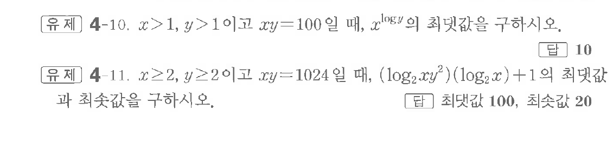

# 유제 4-10

## 문제

$x>1,\ y>1$이고 $xy=100$일 때, $x^{\log y}$의 최댓값을 구하시오.

$x\ge2,\ y\ge2$이고 $xy=1024$일 때, $(\log_2xy^2)(\log_2x)+1$의 최댓값과 최솟값을 구하시오.

## 정답

첫 번째 문제: $10$

두 번째 문제: 최댓값 $100$, 최솟값 $20$

## 원문 문제

## 원문

