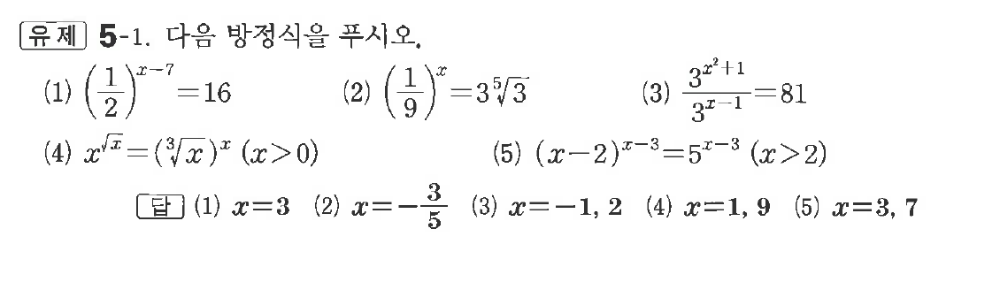
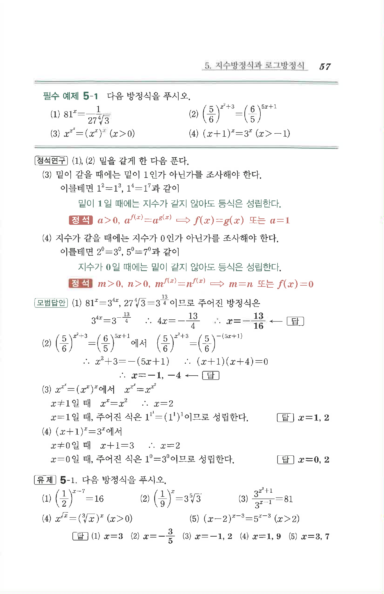

# 유제 5-1

## 문제

다음 방정식을 푸시오.

(1) $\left(\dfrac12\right)^{x-7}=16$

(2) $\left(\dfrac19\right)^x=3\sqrt[5]{3}$

(3) $\dfrac{3^{x^2}+1}{3^{x-1}}=81$

(4) $x^{\sqrt{x}}=(\sqrt[3]{x})^x\quad(x>0)$

(5) $(x-2)^{x-3}=5^{x-3}\quad(x>2)$

## 정답

(1) $x=3$  
(2) $x=-\dfrac35$  
(3) $x=-1,\ 2$  
(4) $x=1,\ 9$  
(5) $x=3,\ 7$

## 원문 문제

## 원문

