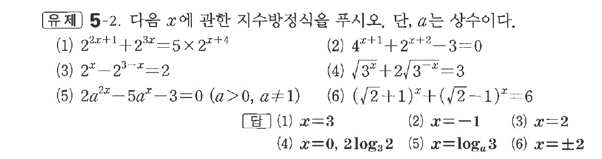

# 유제 5-2

## 문제

다음 $x$에 관한 지수방정식을 푸시오. 단, $a$는 상수이다.

(1) $2^{2x+1}+2^{3x}=5\times2^{x+4}$

(2) $4^{x+1}+2^{x+2}-3=0$

(3) $2^x-2^{3-x}=2$

(4) $\sqrt{3^x}+2\sqrt{3^{-x}}=3$

(5) $2a^{2x}-5a^x-3=0\quad(a>0,\ a\ne1)$

(6) $(\sqrt2+1)^x+(\sqrt2-1)^x=6$

## 정답

(1) $x=3$  
(2) $x=-1$  
(3) $x=2$  
(4) $x=0,\ 2\log_32$  
(5) $x=\log_a3$  
(6) $x=\pm2$

## 원문 문제

## 원문

